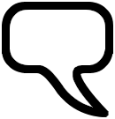
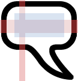
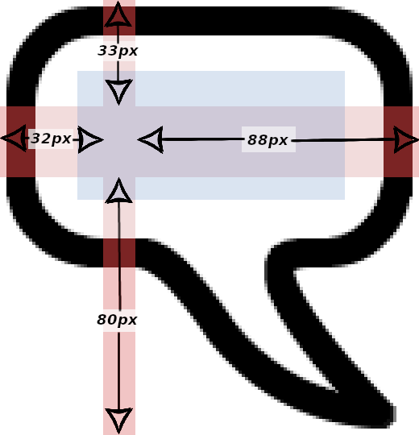
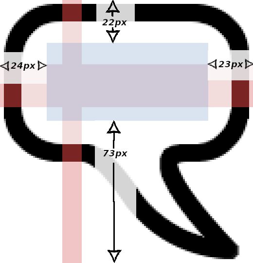

# Frames & Styles

The bulk of the system relies on subscreens that include a frame which contains the dialogue text. For longer text strings we want the frame background to get larger. For shorter text strings we want that background to shrink. Other than specifying a minimum size, we let the shown background expand to fit the text, forcing it to use linebreaks at the default maximum width setting or at a different size by passing a value.

First though we need to make sure the text itself uses some specific style settings. We need to make sure our bubble text does not use the default settings applied through various gui values.

## The Text Style

The standard Ren'Py dialogue styles are a bit more convoluted than basic styles as the system uses named widgets in the screen and then uses keywords that include those names to alter any default styles applied to those named widgets.

The widget in the say screen that we are interested in is a text widget with the id "what". After inheriting the usual text styles, that widget then takes styles passed using that keyword plus an underscore.

A Character can have parameters beginning with what_ and dialogue can have keywords beginning with what_
```py
define e = Character("Eileen", what_color="#D89")
# or
label start:
    e "Hello World" (what_color="#D45")
```

There are two main properties that we want to alter. We want the `xsize` and `align` values to be `None` and `(0, 0)` respectively.

Though there are a number of ways we could achieve that, the simplest is just to write a base style and tell all our Characters who use the bubbles to use that style. We can then tweak other `what_` settings as desired.
```py
style bubble_speech_text:
    xsize None # needed - otherwise it uses a gui setting
    align (0,0) # also likely needed

    # You could include your standard font specific stuff
    color "#F00"
    # font ""
    kerning -1.0
    size 26
    bold True
    # etc etc

## Define the Character, set the screen they use, tell them which style to use for the "what" widget
define speech_bubble_k = Character(
    "Kaori", 
    screen="bubble_say", 
    what_style="bubble_speech_text",
    what_color="#FDD")
```
These now make sure that the dialogue text does not try to take the screen width or sit at an offset.

## Styling Frames

Now we have made sure our text is appearing in a suitable rectangle we can handle how our frames respond to that (variable size) area.

At a basic level, every subscreen is just:
```py
screen bubble_subscreen(who, **kwargs):

    style_prefix "bubble_speech_baseright" # This is actually passed through keywords
    
    fixed:

        pos (450, 320) # Our x, y position, also through keywords

        frame:

            text "The Text" # Actually transcluded from the parent screen
```
In order to get the `frame:` there to have a nice background (that expands to fit the contained text) we use a style beginning with the prefix and ending with `_frame`

We can have lots of these styles, one for each style of bubble we use - set up specially to accomodate the stretching image used as the background.
```py
style bubble_speech_baseright_frame:

    # our background picture
    background Frame(
        "images/speech_bubble.png", 
        left = Borders(32, 33, 88, 80)
        )

    # These are the distance between the text area and frame outer edge
    left_padding 24
    top_padding 22
    right_padding 23
    bottom_padding 73
    # We *could* do all that in one line with
    # padding (24, 22, 23, 73) # (left, top, right, base)

    minimum (121, 114)

    # Now the anchor (the pixel of this widget to place at the stated pos)
    # This should generally reflect where the end of the tail lies
    anchor (1.0, 1.0)
    # You could add a slight offset if wanted (so show_pos is on the tail)
    offset (12, 7)
```
So, the `frame:` that the `_frame` style applies to has a background which is a `Frame`... hmmm... 

The `frame:` is a screen language container which naturally shrinks to fit its contents.

The `Frame` is a special type of displayable which can stretch or tile parts of itself to fit the size allocated to it.

Let's take it one part at a time

## Our Background Image



This image will need to stretch or tile in certain places to match the size it needs. We can picture the areas that stretch, the fixed areas and the area allocated to the contained text in the following image.



The red shaded area is the parts that stretch. See that we have not let the curved corners stretch and have not let any part of the tail stretch.

The blue shaded area represents the part where text can be placed. Note that it does not have to match the red stretchable parts, it can extend into the unstretched areas if wanted. As that part expands it causes the full Frame to expand and thus adjust the sizes of the stretched parts.

## The background Frame
```py
    background Frame(
        "images/speech_bubble.png", 
        left = Borders(32, 33, 88, 80)
        )
```
The first parameter tells it the image we use. This one is our actual file without any transformations.

The `left = ` part specifies a Borders object which is just a way of passing the left, top, right and base values. If you prefer to just set the values to the Frame, feel free.

You can see the values reflected in this image and can see that they relate to the distance from each edge inwards until they reach the red stretchable part.



## The frame: padding
```py
    # These are the distance between the text area and frame outer edge
    left_padding 24
    top_padding 22
    right_padding 23
    bottom_padding 73
    # We *could* do all that in one line with
    # padding (24, 22, 23, 73) # (left, top, right, base)
```
As the comments imply, these are paddings applied to the screen language `frame:` container and are used to tell the frame how much larger than its content it actually is.

You can see the values reflected in this image and can see that they relate to the distance from each edge inwards until they reach the blue part designated for the text content.



## Other style values
```py
    minimum (121, 114)
```
This setting just makes sure our Speech Bubble does not shrink too small and look strange. 

```py
    # Now the anchor (the pixel of this widget to place at the stated pos)
    # This should generally reflect where the end of the tail lies
    anchor (1.0, 1.0)
    # You could add a slight offset if wanted (so show_pos is on the tail)
    offset (12, 7)
```
These allow us to specify one corner of the `frame:` as our anchor and then fine tune that by a number of pixels so the point of the tail sits directly on the pos we passed for that line of dialogue.


That style is basically repeated seven times to cover the tail being in eight different places.


### Navigation:

Back to the main page [Home](README.md)

The overview of the system is more fully explained in [Speech Bubbles Overview](explain_screens.md)

The parameters and usage guidelines are explained in [Using the Speech Bubbles system](explain_usage.md)
